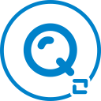

# Exadel Query Kit for AEM
#### (part of Exadel Toolbox - EToolbox)
***


This solution provides the UI and API for easily creating and transforming data queries in languages such as XPath, JCR-SQL2, etc. for the AEM ecosystem.

**EToolbox Query Kit** provides the ability to intuitively compose and run simple and complex queries against the data storage (JCR repository), save and share ready queries, store and export query results.

**EToolbox Query Kit** aims to decrease the effort of content management; improve the maintainability of AEM sites;
provide tools for greater data visualization and analysis.

### Project structure

The project consists of the following modules:

* *core* module runs as an OSGi bundle in an AEM instance containing services that respond to user commands and provide data processing.
* *ui.apps* module embeds into AEM administering interface and runs in browser to provide a user interface for query management and data display.
* *ui.content* contains configuration data and assets.

### Requirements

The project is developed and tested in *AEM 6.5* (*uber-jar* 6.5.0) with Java 1.8 / Java 11. Please compile and use in other environments with caution.

### Installation

**EToolbox Query Kit** is distributed as a package you can install by hand or, optionally, add to your project building workflow via e.g. *Content Package Maven Plugin* (either *Adobe* version or *wcm.io* version).

Alternatively, you can build and install **EToolbox Query Kit** from the source code. Clone this repository and run
```
    mvn clean install -PautoInstallPackage

```

from the command line.

Run an additional *buildUi* profile to trigger recompiling the frontend code UI parts.

```
   mvn clean install -PbuildUi -PautoInstallPackage
```

You can change `aem.host` and `aem.port` values as needed in the main POM file's <properties> section or via a command-line key like `-Daem.host=xxx -Daem.port=xxx` (default is *localhost:4502*).


### Usage

In your _Adobe Experience Manager_ console, navigate to the *Tools* section and choose *EToolbox* from the left menu rail. Click *"EToolbox Query Kit"* icon in the right section.

*EToolbox Query Console* opens. Use the editor window to the left to compose a query in *JCR-SQL2* / *XPath* / *QueryBuilder* formats (autocompletion works for the *JCR-SQL2* format); then press the *Execute* button below so that the query is run, and the results are displayed as a table in the right part of the screen. 

Beside the *"Execute"* button, there are buttons for storing a query and sharing it via clipboard.

To create a query in the graphic interface, press the *"New"* button in the toolbar and select from several pre-defined query dialogs, then fill in the web form.

Some values in these dialogs are prefilled. This is defined by the current *user profile*. You can choose a profile (if there are several ones) from the dropdown in the right top corner of the screen.

The *"Open"* button in the toolbar triggers a dropdown menu from which you can select and put in the editor window either a saved query or any from the ten latest successful queries executed in this instance.

### Testing and development

The source code of the project is test-covered. You can run unit tests apart from the usual Maven build workflow with

    mvn clean test

There is also the specific "test" profile that helps to collect code quality statistics, engage test coverage analysis, etc. Run it with e.g.

    mvn clean verify sonar:sonar -Ptest -Dsonar.host.url=[....]


### Contributions

The project is in active development stage. Community contribution is heartily welcome.

Please accept the [Contributor License Agreement](CLA.md) to add contributions to the project.

When preparing your contribution please follow [the guideline](CONTRIBUTING.md). A pull-request that does not conform to the contributing guideline can be rejected.

### Licensing

The project is licensed under [Apache License, Version 2.0](LICENSE). All runtime project dependencies are guaranteed to be compliant with the license, or else distributed under an equivalently free license. Dependencies such as Adobe's *uber-jar* are considered *provided* in the end-user environment and are not explicitly engaged. The end-user is to comply with the regulations of the corresponding licenses. 
